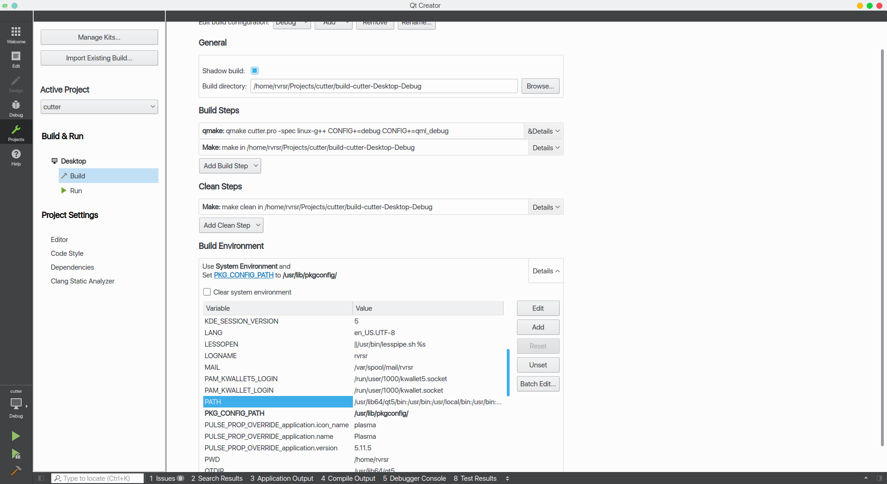

# Common errors

## Errors on Linux or OS X
Please make sure you have the appropriate QT version: [https://www.qt.io/qt5-9/](https://www.qt.io/qt5-9/)

### OS X compiling issues
On Mac, QT5 apps fail to build on QtCreator if you have the libjpeg lib installed with brew. Run this command to workaround the issue:

	sudo mv /usr/local/lib/libjpeg.dylib /usr/local/lib/libjpeg.dylib.not-found
	
If you encounter the `Project ERROR: r_core development package not found` try one of this commands instead:

- `PKG_CONFIG_PATH=$HOME/bin/prefix/radare2/lib/pkgconfig qmake`
- `PKG_CONFIG_PATH=$HOME/cutter/radare2/pkgcfg qmake` (for modern version and if radare2 was installed like the submodule)

### Compilation error
> r_core development package not found

If you installed radare2 and still encounter this error, could be your `PATH` environment variable is set improperly (doesn't contain `/usr/local/bin`). That can be, for example, due to `Qt Creator.app` being copied over to `/Applications`.
To fix this, append:

> :/usr/local/bin

to the `PATH` variable within the *Build Environment* section in Qt Creator. See the screenshot below should you encounter any problems.



Or radare2 libs could be installed to `/usr/lib/pkgconfig/`, so you can add variable `PKG_CONFIG_PATH` with value `/usr/lib/pkgconfig/`

### Keyboard layout issue
Some people report that they have keyboard issues. Usually it is because the Xorg layout is wrong. You can check it with:
```setxkbmap -query``` Most of the time using ```setxkbmap us``` solves the issue, but it might not be enough and require some more advanced Xorg configuration. 

## Windows

See [Compiling on Windows](https://github.com/radareorg/cutter/blob/master/docs/Compiling-on-Windows.md).
