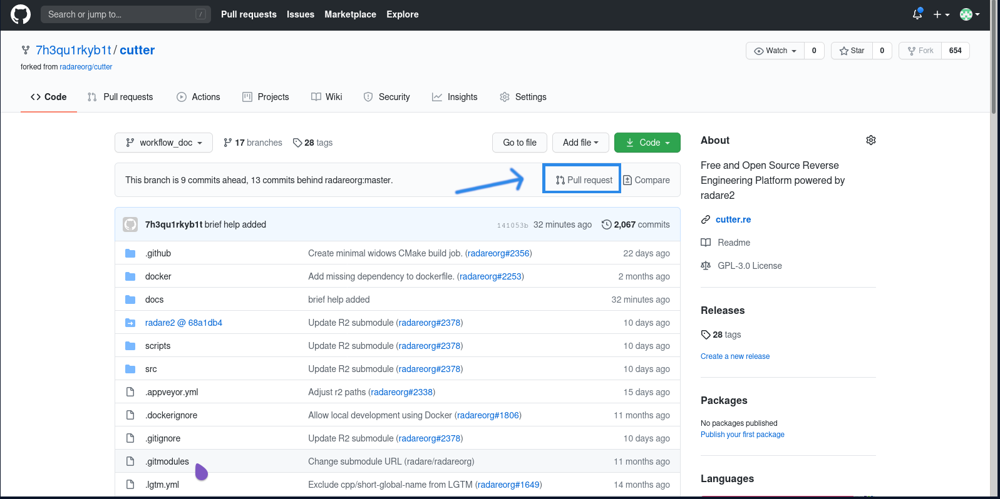
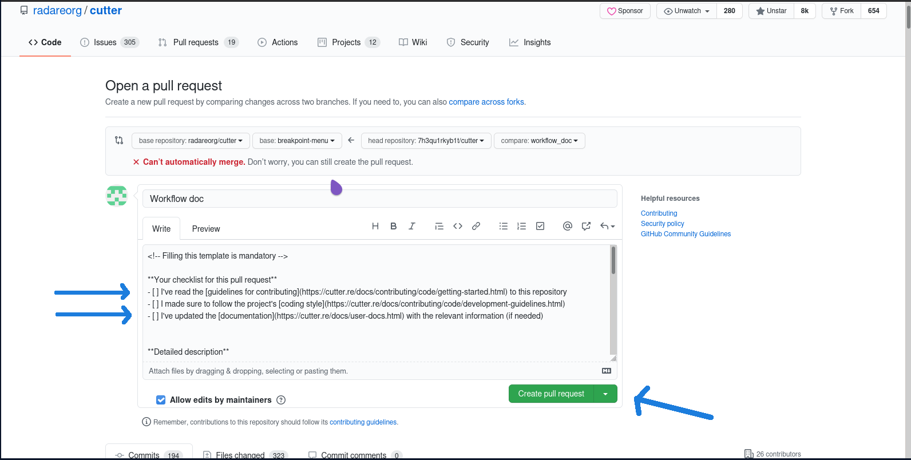
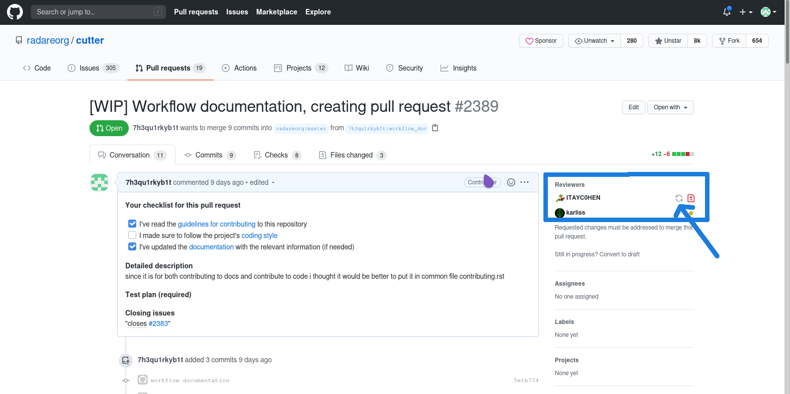

Beginners guide for contributing
================================
If you want to contribute and don't know how to help this is the guide for you

Steps for Contributing
======================
.. [#] Fork the project on github.
.. [#] clone the project to your local machine.
  ``git clone --recurse-submodules https://github.com/radareorg/cutter``.
.. [#] Create a branch based on topic. avoid working on master.
  ``git checkout -b <branch name``.
.. [#] add the fork to your local repository by
  ``git remote add fork https://github.com/<youride>/cutter``.
.. [#] Make changes and commit by
  ``git add .``
  ``git commit -m "commit message"``
.. [#] Push it to your forked branch.
  ``git push fork``
.. [#] Create a Pull request and wait for review. If your commit solves any issues then specify those
.. [#] If any changes requested then do the changes locally and commit changes and push it your fork.
.. [#] If everything is okay your request will be merged and repeat.
.. [#] If you are working on new feature until your PR gets merged then create another branch and work

This is a brief guide for contribution. Lets elaborate things:-

:Fork and clone the project::

* first thing is to fork the repository.
* Clone the project and create a new branch.

.. code-block:: bash

  ~$ git clone https://github.com/radareorg/cutter.git
    Cloning into 'cutter'...
    remote: Enumerating objects: 28, done.
    remote: Counting objects: 100% (28/28), done.
    remote: Compressing objects: 100% (25/25), done.
    remote: Total 16823 (delta 11), reused 4 (delta 3), pack-reused 16795
    Receiving objects: 100% (16823/16823), 12.68 MiB | 5.29 MiB/s, done.
    Resolving deltas: 100% (13021/13021), done.

  ~$ cd cutter/
    cutter(master)$ git checkout -b topic
    Switched to a new branch 'topic'

:Commit and push::

* make your change in code.
* commit change to the topic branch

.. code-block:: bash

  cutter(topic)$ git commit -a -m "change description"
    [topic 141053bc] change description added
    1 file changed, 1 insertion(+), 19 deletions(-)

* add remote forked repository url

.. code-block:: bash

  cutter(topic)$ git remote add fork https://github.com/<username>/cutter
  
* push to forked repository

.. code-block:: bash

  cutter(topic)$ git push fork topic
    Enumerating objects: 9, done.
    Counting objects: 100% (9/9), done.
    Delta compression using up to 4 threads
    Compressing objects: 100% (5/5), done.
    Writing objects: 100% (5/5), 454 bytes | 454.00 KiB/s, done.
    Total 5 (delta 4), reused 0 (delta 0), pack-reused 0
    remote: Resolving deltas: 100% (4/4), completed with 4 local objects.
    To github.com:<username>/cutter.git
       0539e708..141053bc  topic -> topic

:Create a Pull Request::

Now go to your forked repository on github. It should look like below.

Click on the Pull request to make a pull request. Make sure that you are on the topic branch that you created

* fill in the check boxes by inserting x inside square brackets, making sure that you took those steps.
* fill other details requested in template. If the change resolves any issues then mention those here.
* Click on ``Create pull request``

:change requests::

Now your PR (Pull request) will be reviewed. If any change is requested then
  * make those changes in your topic branch locally.
  * commit those changes.
  * push to your commits to your fork repository. As we did this in above steps, no need to add the repo again.
  * Now your PR will auto updates.

* now reviewers can review your PR again or you may notify them by clicking on Re-request review as above

If everything is okay then your PR will be merged. Now you make further improvements in the project by making more PR's

