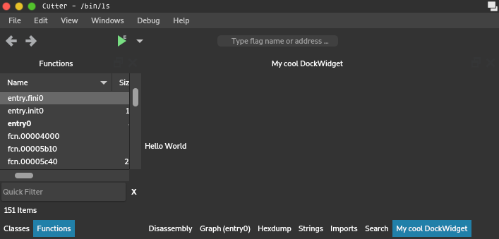
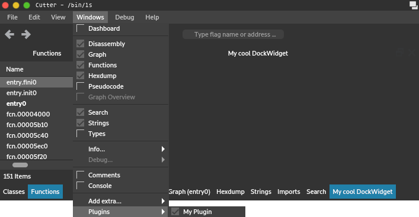
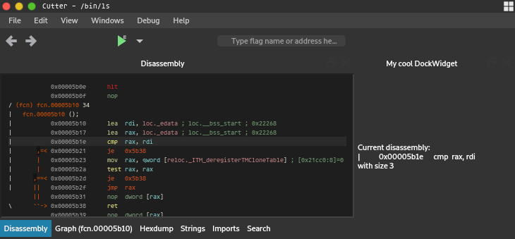

Getting Started with Python Plugins
===================================

This article provides a step-by-step guide on how to write a simple Python plugin for Cutter.

Create a python file, called ``myplugin.py`` for example, and add the following contents:

.. code-block:: python

   import cutter

   class MyCutterPlugin(cutter.CutterPlugin):
       name = "My Plugin"
       description = "This plugin does awesome things!"
       version = "1.0"
       author = "1337 h4x0r"

       def setupPlugin(self):
           pass

       def setupInterface(self, main):
           pass

       def terminate(self):
           pass

   def create_cutter_plugin():
       return MyCutterPlugin()

This is the most basic code that makes up a plugin.
Python plugins in Cutter are regular Python modules that are imported automatically on startup.
In order to load the plugin, Cutter will call the function ``create_cutter_plugin()`` located
in the root of the module and expects it to return an instance of ``cutter.CutterPlugin``.
Normally, you shouldn't have to do anything else in this function.

.. note::
   The Cutter API is exposed through the ``cutter`` module.
   This consists mostly of direct bindings of the original C++ classes, generated with Shiboken2.
   For more detail about this API, see the Cutter C++ code or :ref:`api`.

The ``CutterPlugin`` subclass contains some meta-info and two callback methods:

* ``setupPlugin()`` is called right after the plugin is loaded and can be used to initialize the plugin itself.
* ``setupInterface()`` is called with the instance of MainWindow as an argument and should create and register any UI components.
* ``terminate()`` is called on shutdown and should clean up any resources used by the plugin.

Copy this file into the ``python`` subdirectory located under the plugins directory of Cutter and start the application.
You should see an entry for your plugin in the list under Edit -> Preferences -> Plugins.
Here, the absolute path to the plugins directory is shown too if you are unsure where to put your plugin:

.. image:: preferences-plugins.png

.. note::
   As mentioned, plugins are Python modules. This means, instead of only a single .py file, you can also
   use a directory containing multiple python files and an ``__init__.py`` file that defines or imports the
   ``create_cutter_plugin()`` function.

.. note::
   If you are working on a Unix-like system, instead of copying, you can also symlink your plugin into the plugins
   directory, which lets you store the plugin somewhere else without having to copy the files over and over again.

Creating a Widget
-----------------

Next, we are going to add a simple dock widget. Extend the code as follows:

.. code-block:: python

   import cutter

   from PySide2.QtWidgets import QAction, QLabel

   class MyDockWidget(cutter.CutterDockWidget):
       def __init__(self, parent, action):
           super(MyDockWidget, self).__init__(parent, action)
           self.setObjectName("MyDockWidget")
           self.setWindowTitle("My cool DockWidget")

           label = QLabel(self)
           self.setWidget(label)
           label.setText("Hello World")

   class MyCutterPlugin(cutter.CutterPlugin):
       # ...

       def setupInterface(self, main):
           action = QAction("My Plugin", main)
           action.setCheckable(True)
           widget = MyDockWidget(main, action)
           main.addPluginDockWidget(widget, action)

   # ...

We are subclassing ``cutter.CutterDockWidget``, which is the base class for all dock widgets in Cutter,
and adding a label to it.

.. note::
   You can access the whole Qt5 API from Python, which is exposed by PySide2. For more information about this, refer to the
   Documentation of `Qt <https://doc.qt.io/qt-5/reference-overview.html>`_ and `PySide2 <https://wiki.qt.io/Qt_for_Python>`_.

In our ``setupInterface()`` method, we create an instance of our dock widget and an action to be
added to the menu for showing and hiding the widget.
MainWindow provides a helper method called ``addPluginDockWidget()`` to easily register these.

When running Cutter now, you should see the widget:

... as well as the action:

Fetching Data
-------------

Next, we want to show some actual data from the binary in our widget.
As an example, we will display the instruction and instruction size at the current position.
Extend the code as follows:

.. code-block:: python

   # ...

   class MyDockWidget(cutter.CutterDockWidget):
       def __init__(self, parent, action):
           # ...

           label = QLabel(self)
           self.setWidget(label)

           disasm = cutter.cmd("pd 1").strip()

           instruction = cutter.cmdj("pdj 1")
           size = instruction[0]["size"]

           label.setText("Current disassembly:\n{}\nwith size {}".format(disasm, size))

   # ...

We can access the data by calling Rizin commands and utilizing their output.
This is done by using the two functions ``cmd()`` and ``cmdj()``, which behave just as they
do in `rz-pipe <https://book.rizin.re/scripting/rz-pipe.html>`_.

Many commands in Rizin can be suffixed with a ``j`` to return JSON output.
``cmdj()`` will automatically deserialize the JSON into python dicts and lists, so the
information can be easily accessed.

.. warning::
   When fetching data that is not meant to be used only as readable text, **always** use the JSON variant of a command!
   Regular command output is not meant to be parsed and is subject to change at any time, which will break your code.

In our case, we use the two commands ``pd`` (Print Disassembly) and ``pdj`` (Print Disassembly as JSON)
with a parameter of 1 to fetch a single line of disassembly.

.. note::
   To try out commands, you can use the Console widget in Cutter. Almost all commands support a ``?`` suffix, like in
   ``pd?``, to show help and available sub-commands.
   To get a general overview, enter a single ``?``.

The result will look like the following:

.. image:: disasm-static.png

Of course, since we only fetch the info once during the creation of the widget, the content never updates.
We are going to change that in the next section.

Reacting to Events
------------------

We want to update the content of our widget on every seek.
This can be done like the following:

.. code-block:: python

   # ...

   from PySide2.QtCore import QObject, SIGNAL

   # ...

   class MyDockWidget(cutter.CutterDockWidget):
       def __init__(self, parent, action):
           # ...

           self._label = QLabel(self)
           self.setWidget(self._label)

           QObject.connect(cutter.core(), SIGNAL("seekChanged(RVA)"), self.update_contents)
           self.update_contents()

       def update_contents(self):
           disasm = cutter.cmd("pd 1").strip()

           instruction = cutter.cmdj("pdj 1")
           size = instruction[0]["size"]

           self._label.setText("Current disassembly:\n{}\nwith size {}".format(disasm, size))

First, we move the update code to a separate method.
Then we call ``cutter.core()``, which returns the global instance of ``CutterCore``.
This class provides the Qt signal ``seekChanged(RVA)``, which is emitted every time the current seek changes.
We can simply connect this signal to our method and our widget will update as we expect it to:

For more information about Qt signals and slots, refer to `<https://doc.qt.io/qt-5/signalsandslots.html>`_.

Full Code
---------

.. code-block:: python

   import cutter

   from PySide2.QtCore import QObject, SIGNAL
   from PySide2.QtWidgets import QAction, QLabel

   class MyDockWidget(cutter.CutterDockWidget):
       def __init__(self, parent, action):
           super(MyDockWidget, self).__init__(parent, action)
           self.setObjectName("MyDockWidget")
           self.setWindowTitle("My cool DockWidget")

           self._label = QLabel(self)
           self.setWidget(self._label)

           QObject.connect(cutter.core(), SIGNAL("seekChanged(RVA)"), self.update_contents)
           self.update_contents()

       def update_contents(self):
           disasm = cutter.cmd("pd 1").strip()

           instruction = cutter.cmdj("pdj 1")
           size = instruction[0]["size"]

           self._label.setText("Current disassembly:\n{}\nwith size {}".format(disasm, size))

   class MyCutterPlugin(cutter.CutterPlugin):
       name = "My Plugin"
       description = "This plugin does awesome things!"
       version = "1.0"
       author = "1337 h4x0r"

       def setupPlugin(self):
           pass

       def setupInterface(self, main):
           action = QAction("My Plugin", main)
           action.setCheckable(True)
           widget = MyDockWidget(main, action)
           main.addPluginDockWidget(widget, action)

       def terminate(self):
           pass

   def create_cutter_plugin():
       return MyCutterPlugin()
