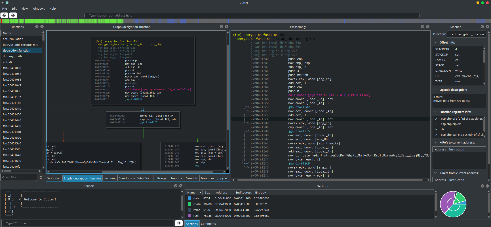

Cutter
======

Cutter is a Qt and C++ GUI for radare2. Its goal is to provide an advanced,
customizable and FOSS reverse-engineering platform while keeping the
user experience in mind. Cutter was created by reverse engineers for
reverse engineers.

Get Cutter
----------

Cutter is available for all platforms (Linux, OS X, Windows). You can
download the latest release
`here <https://github.com/radareorg/cutter/releases>`__.

- OSX: Download the latest ``.dmg`` file.
- Windows: Download the latest archive.
- Linux: use the AppImage file. Then just make it executable and run it: ``chmod +x Cutter-v1.10.0-x86_64.AppImage``

Building from sources
---------------------

To build Cutter on your local machine, please follow this guide:
`Building from source <building.html>`__

Need help?
----------

You can contact the *Cutter* developers and community on:

-  Telegram: https://t.me/r2cutter
-  #cutter on irc.freenode.net
-  Twitter: https://twitter.com/r2gui

Want to help the project?
-------------------------

If you want to contribute to Cutter, take a look
`here <https://github.com/radareorg/cutter/blob/master/CONTRIBUTING.md>`__
to learn how you can help improve the project!

.. toctree::
   :maxdepth: 2
   :caption: Contents:

   shortcuts
   building
   common-errors
   code
   plugins
   api

