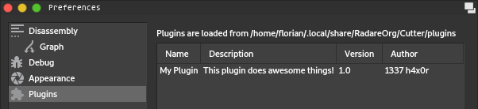

Plugins
=======

Cutter supports writing plugins in both C++ and Python.
If you are unsure of which language to choose, starting with Python is strongly suggested as
it provides a faster and simpler workflow.

If you plan to implement support for a new file format or architecture, Cutter plugins are not the correct approach.
Instead, you will want to implement a radare2 plugin, which is documented `here <https://radare.gitbooks.io/radare2book/plugins/intro.html>`_.

Loading and Overview
--------------------

Plugins are loaded from an OS-dependent user-level directory.
To get the location of this directory and a list of currently loaded plugins, navigate to Edit -> Preferences -> Plugins.

The plugins directory contains two subdirectories, ``native`` and ``python`` for C++ and Python plugins respectively,
which will be created automatically by Cutter.

.. note::
   The support for Python plugins is only available if Cutter was built with the options ``CUTTER_ENABLE_PYTHON``
   and ``CUTTER_ENABLE_PYTHON_BINDINGS`` enabled.
   This is the case for all official builds from GitHub Releases starting with version 1.8.0.

Creating Plugins
---------------

.. toctree::
   :glob:

   plugins/*
