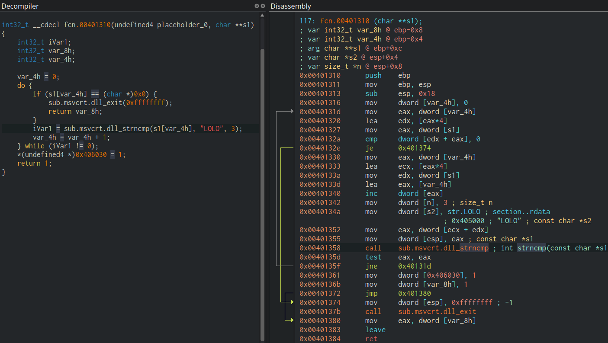

Features
========
This section in the user docs gives a more detailed information about different features in Cutter. These are the different
utilities and views that can be used and controlled by you during your session. As more familiar and comfort you feel with the
different features in Cutter, the more efficient and effective you are during your reverse-engineering experience.

Decompiler
----------
A decompiler is a program that will analyze binaries and attempt to create a high-level representation of the machine code in it. In other words, it tries to reconstruct the source code from which the binary was compiled in the first place.

Here's an image that compares one of the decompiler Cutter supports with the Cutter's disassembler.

Cutter provides an interface that supports plugins of multiple decompilers including Ghidra, RetDec and JSDec. The interface receives data from the decompiler and presenting the decompiler code in a context-sensitive decompiler widget. Check the `Decompilers <https://github.com/rizinorg/cutter-plugins#decompilers>`_ section on our Plugins repository to know more about the decompilers we support.

Out of the decompiler plugins that we support, the one that's officially maintained by the developers of Cutter is RzGhidra. :doc:`Click here <menus/decompiler-context-menu>` to learn more about the functionalities we provide in the decompiler.
