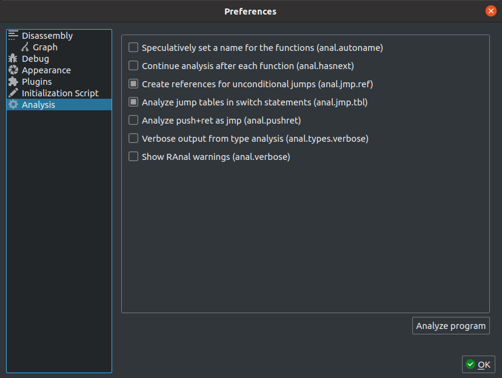

Analysis Options
================

Cutter will use the underlying Rizin analysis options to analyze a binary. These options are usually 
configured when the binary is first loaded. However, they can be later changed using the Analysis 
dialog, and a new analysis that takes these options into account can then be performed.

Analysis Dialog
---------------

**Description:** The Analysis dialog allows setting some Rizin's analysis options. The supported options are described
below.

Clicking on the "Analyze Program" button will trigger an analysis of the current binary with Rizin's ``aaa``
command, taking into account the configured values of the analysis options.

**Steps to open:** ``Edit -> Preferences -> Analysis``

Search boundaries for analysis
~~~~~~~~~~~~~~~~~~~~~~~~~~~~~~
Select the boundaries in which the analyis will be performed. The different options are:

- All executable maps (``io.maps.x``)
- All maps (``io.maps``)
- Current map (``io.map``)
- Raw (``raw``)
- Current mapped section (``bin.section``)
- All mapped sections (``bin.sections``)

**Configuration variable:** ``analysis.in``

Speculatively set a name for the functions
~~~~~~~~~~~~~~~~~~~~~~~~~~~~~~~~~~~~~~~~~~
Try to name functions without symbols by using artifacts in the functions such as API calls and strings.

**Configuration variable:** ``analysis.autoname``

Search for new functions following already defined functions
~~~~~~~~~~~~~~~~~~~~~~~~~~~~~~~~~~~~~~~~~~~~~~~~~~~~~~~~~~~~
Cutter will check if there is a candidate for a new function following an already defined one, as the compiler usually
state them together. This option is taking the advantages of both Recursive Analysis and Linear Sweep into some kind of a hybrid mode. For each discovered function, the analysis will try to check for a function-prologue, usually following a gap of null bytes or ``cc`` bytes. This will help with discovering functions which are not referenced in the program. As such, it will make the analysis slower and prone to false-positives.

**Configuration variable:** ``analysis.hasnext``

Create references for unconditional jumps
~~~~~~~~~~~~~~~~~~~~~~~~~~~~~~~~~~~~~~~~~
When encountering unconditional jumps during the analysis, Cutter will add a code-reference even if it is not guaranteed
that the jump will take place.

**Configuration variable:** ``analysis.jmp.ref``

Analyze jump tables in switch statements
~~~~~~~~~~~~~~~~~~~~~~~~~~~~~~~~~~~~~~~~
When encountering switch statements during analysis, continue and analyze the target blocks of the jump tables.

**Configuration variable:** ``analysis.jmp.tbl``

Analyze ``push`` + ``ret`` as ``jmp``
~~~~~~~~~~~~~~~~~~~~~~~~~~~~~~~~~~~~~
When performing analysis of a function, treat the sequence of ``push`` followed by ``ret`` instruction as a ``jmp``.
This can help Cutter to continue the analysis to target of the ``jmp``.

**Configuration variable:** ``analysis.pushret``

Show verbose information when performing analysis
~~~~~~~~~~~~~~~~~~~~~~~~~~~~~~~~~~~~~~~~~~~~~~~~~
When enabled, Cutter will print warnings it encountered while preforming analysis. These warnings can help the user
understand if anything went wrong in the analysis. This function is not only helpful when trying to perform a full
analysis of the program, but also when trying to analyze and define new functions.

**Configuration variable:** ``analysis.verbose``

Verbose output from type analysis
~~~~~~~~~~~~~~~~~~~~~~~~~~~~~~~~~
Print warnings encountered while preforming type analysis. These warnings can help the user understand if anything went
wrong in the analysis.

**Configuration variable:** ``analysis.types.verbose``

Pointer depth
~~~~~~~~~~~~~
The maximum number of nested pointers to follow in analysis.

**Configuration variable:** ``analysis.ptrdepth``

Functions prelude
~~~~~~~
Hex value that represents certain opcodes that will be used to identify functions.

**Configuration variable:** ``analysis.prelude``
