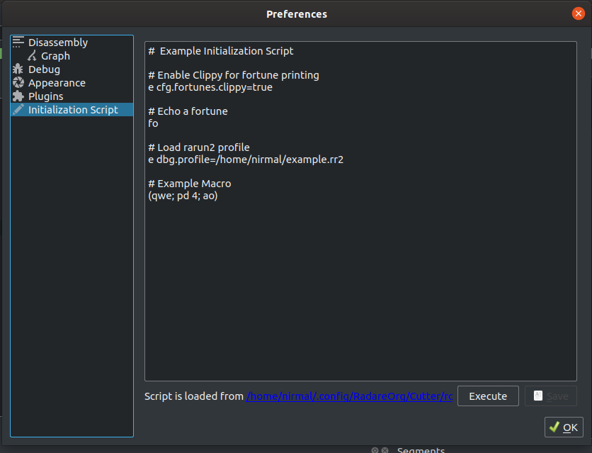

Initialization Script
===================================

On the launch of Cutter, it loads ``.cutterrc`` files from various locations if they are present. The directories from where ``.cutterrc`` files are loaded are all directories of type ``QStandardPaths::AppConfigLocation``. These locations vary according to OS. You can visit `here <https://doc.qt.io/qt-5/qstandardpaths.html>`__ to see all the locations.

If multiple ``.cutterrc`` scripts are present in different directories, all of them will be loaded. In case of conflicting or contradictory commands, the corresponding command in the script loaded last will override all the previous commands. Cutter has a GUI editor for Initialization Script whose description is given below. The script from the editor will be the last loaded initialization script and hence will override all the previous scripts in the event of conflicting commands.

Initialization Script Editor
-----------------------------------

**Description:** You can add new commands and modify existing commands here. To save the script, click on the ``Save`` button. If you want to see the changes you have made without restarting Cutter, you can use the ``Execute`` button. The hyperlink that shows the location of the script will open the directory containing the script on click.

**Steps to open:** ``Edit -> Preferences -> Initialization Script``
