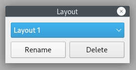

Layout
======

The set of currently opened widgets, their placement, and some properties is grouped into layouts.
Cutter will automatically restore the last layout state when reopening Cutter. The last debug and normal layouts are stored separately.
You can :ref:`save<user-docs/menus/menu-bar/view-menu:Save Layout>` multiple named layouts for different use cases.
Use :doc:`../menus/menu-bar/view-menu` to :ref:`save<user-docs/menus/menu-bar/view-menu:Save Layout>`,
:ref:`load<user-docs/menus/menu-bar/view-menu:Layouts>` or :ref:`user-docs/menus/menu-bar/view-menu:Reset to default layout`.
A named layout is never automatically modified. To modify a previously saved layout, instead of entering a new name, select
an existing layout from the list in Save Layout dialog.

Layout Manager
-----------------------------------

**Description:** Layout manager allows renaming and deleting saved layouts.

**Steps to open:** :doc:`View<../menus/menu-bar/view-menu>` -> :ref:`user-docs/menus/menu-bar/view-menu:Manage Layouts`
