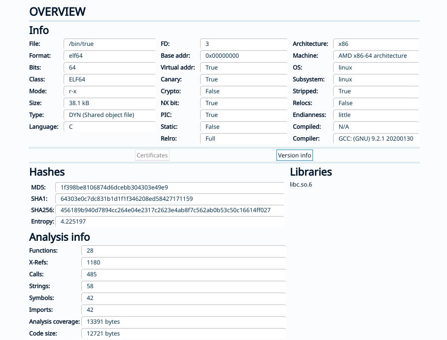
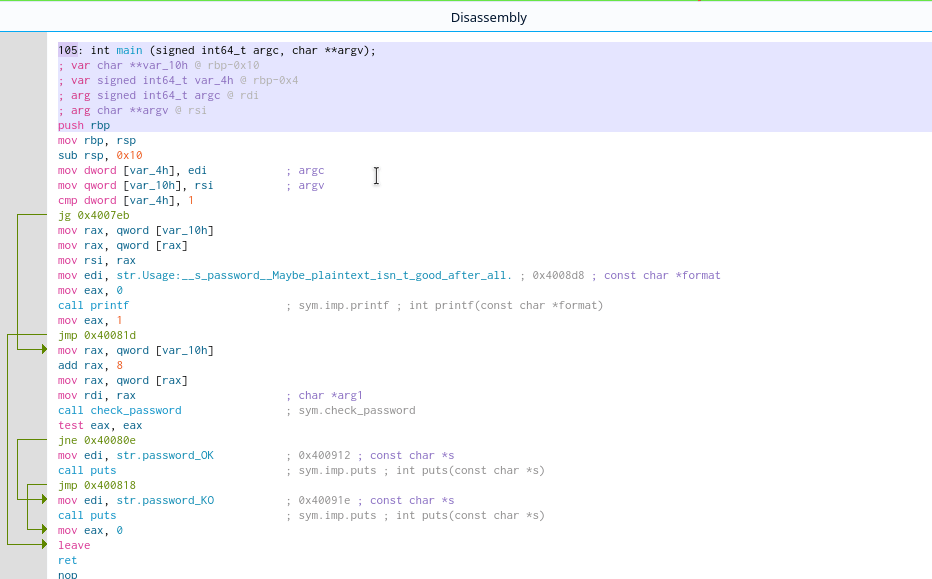
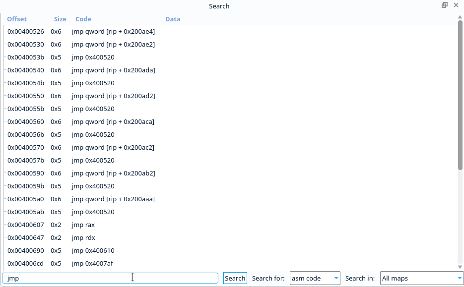
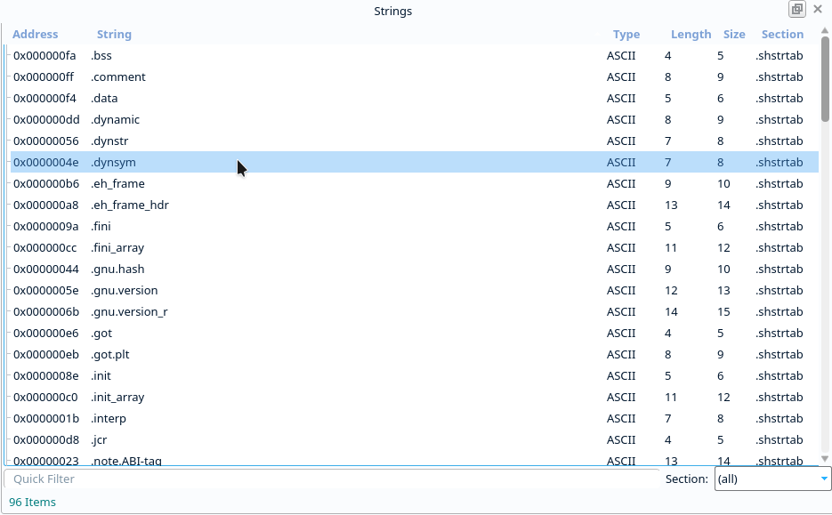

Widgets
=======

Cutter UI consists of several widgets (views) such as Disassembly, Decompiler, and Hexdump.
These widgets provide their own functionality, context menus and synchronization with
other widgets to help users get all sorts of analyses done conveniently and quickly.

These are some of the widgets you can find in Cutter:

    
Dashboard Widget
------------------

Disassembly Widget
------------------

Graph Widget
------------------

.. image:: ../images/widgets/graph.gif

HexDump Widget
------------------

.. image:: ../images/widgets/hexdump.gif

Search Widget
------------------

Strings Widget
------------------

