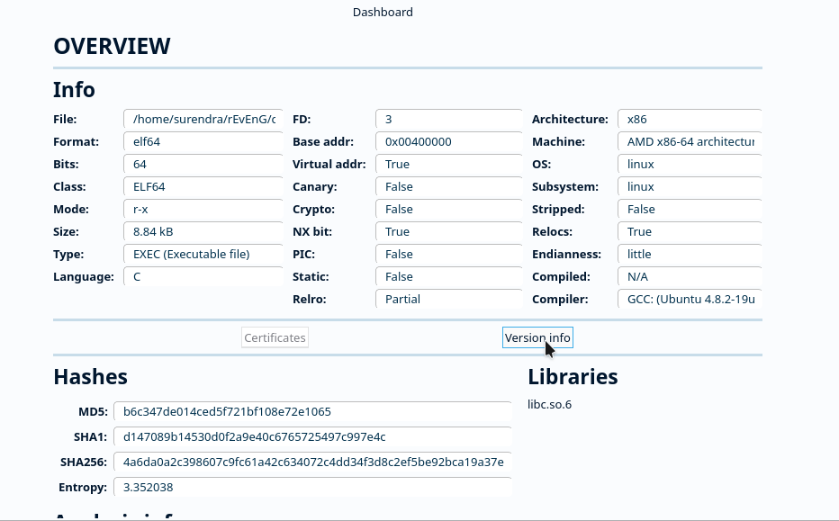
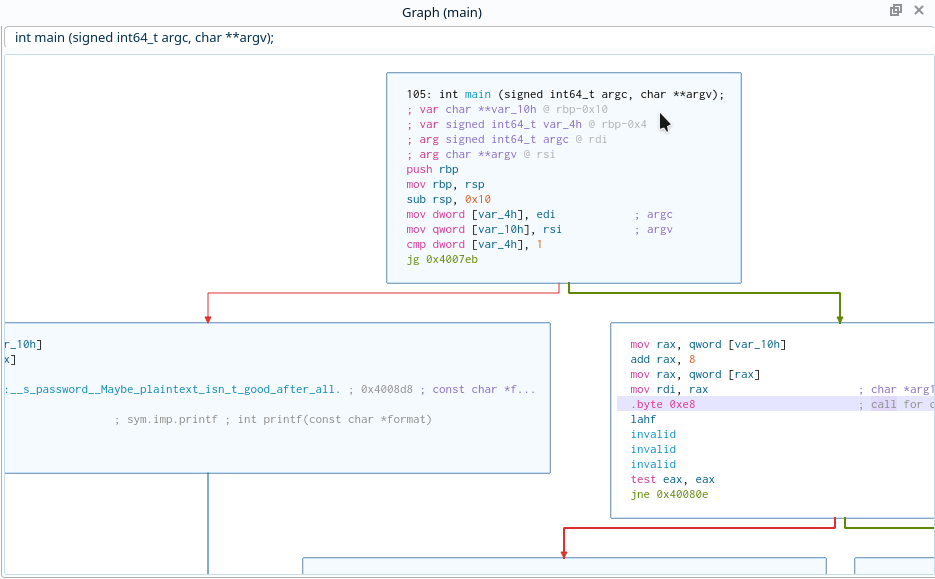
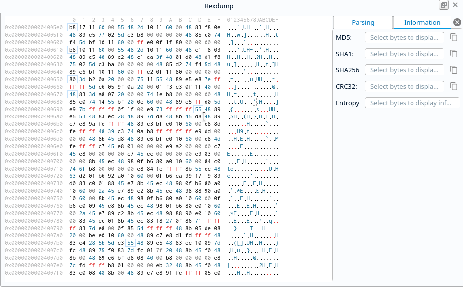
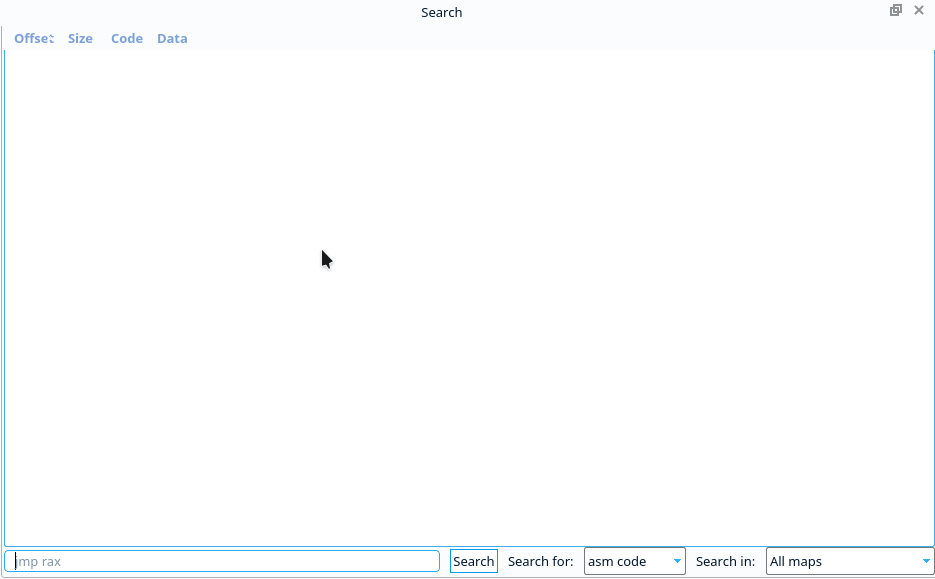
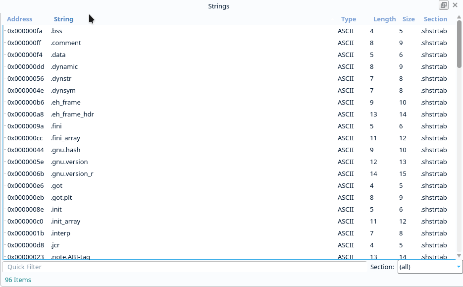

Widgets
=======

Cutter UI consists of several widgets(views) such as: Disassembly, Decompiler, etc.
which provide their own functionality, context menus and synchronisation with
other widgets to help user get all sort of analysis done conveniently and quickly.
Following is a quick overview of these widgets.

Dashboard Widget
------------------

Disassembly Widget
------------------

.. image:: ../images/disassembly.gif

Graph Widget
------------------

HexDump Widget
------------------

Search Widget
------------------

Strings Widget
------------------

